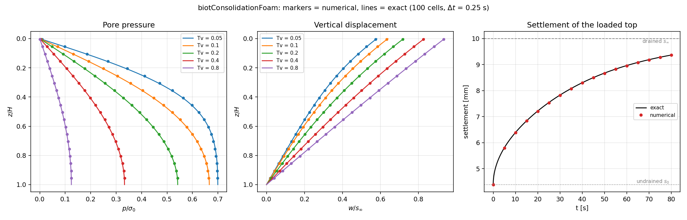
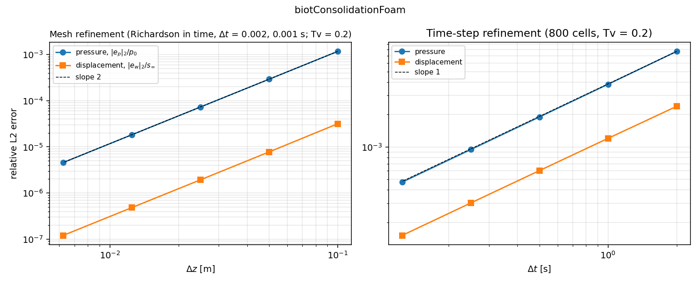

# poroConsolidationFoam

Two finite-volume solvers for one-dimensional soil and rock consolidation, built with foam-extend 4.1. The first solves for pore pressure. The second solves for pressure and displacement together.

This project grew out of my PhD work on fluid flow and rock deformation in hydraulic fracturing. I wanted a small, public example where I could work through the equations, implement the coupling, and check the results against an analytical solution.

## What the solvers do

When a saturated porous material is loaded, the pore fluid initially carries part of the load. As fluid drains out, pore pressure falls and the solid deforms. This project follows that process in a column with a drained, loaded top and a fixed, impermeable base.

| Solver | What it calculates |
| --- | --- |
| `poroConsolidationFoam` | Pressure dissipation using Terzaghi's consolidation equation. The solid response is included in the consolidation coefficient; displacement is not solved separately. |
| `biotConsolidationFoam` | Pore pressure and vertical displacement using the coupled Biot equations. It alternates between flow and mechanics solves using a fixed-stress split. |

Both solvers have been compiled and tested on foam-extend 4.1. The tests cover analytical agreement and mesh and time-step refinement. The coupled solver also has checks for equation residuals, fluid balance, restart behavior, and failure to converge.

## Results

The coupled solver reproduces the analytical pressure and settlement histories. For the default case, the top settles from an instantaneous undrained value of 4.39 mm toward a drained value of 10 mm.



For 100 cells and a time step of 0.25 s:

| Check | Result |
| --- | --- |
| Largest pressure error across the five tabulated times | 0.695% of the initial pressure |
| Largest displacement error across those times | 0.0882% of the final settlement |
| Difference from the Python reference implementation | 1.66 × 10⁻¹⁰ for normalized pressure; 6.03 × 10⁻¹¹ for normalized displacement |
| Coupling iterations per time step | 3.2 on average; 6 at most |
| Largest normalized cumulative fluid-balance error | 2.33 × 10⁻¹⁰, including the stabilization contribution |

Refining the mesh gives approximately second-order accuracy in space. Refining the time step gives first-order accuracy in time. The coupled solver's mesh study uses Richardson extrapolation in time to separate spatial error from time-step error.



The tests also compare the fixed-stress solution with a monolithic reference solve, check that restarting reproduces an uninterrupted run, and confirm that failed iterations and incomplete results are rejected. These results establish performance for the tested one-dimensional cases, rather than for general poromechanics problems.

## Investigating pressure oscillations

The most interesting part of the project was testing the coupled solver with nearly incompressible constituents and small time steps.

With pressure and displacement stored at cell centres, the discrete coupling responds weakly to rapidly alternating pressure patterns. In the tested cases, this produced pressure oscillations and slow fixed-stress convergence. Adding a pressure stabilization term suppressed the oscillations and reduced the iteration count.


In one early-time test, the unstabilized pressure exceeded the initial pressure by 12.5%. Across the stabilized early-time tests, the overshoot was about 1.7 × 10⁻¹¹ or less of the initial pressure. In a separate three-step comparison, stabilization reduced the average iteration count from 758.3 to 18.0.

Some choices of the fixed-stress parameter still failed to converge within the iteration limit. Those results are marked `NC` in the parameter study; the solver stops rather than continuing with an unconverged solution.

This is an investigation of a known class of discretization problems, not a claim of a new stabilization method. The derivation and its limits are described in the [coupled-solver notes](coupled-poroelasticity/README.md).

## Build and run

You need a working foam-extend 4.1 installation and Python 3 with NumPy, SciPy, and Matplotlib. The Python dependencies are listed in `requirements.txt`.

Source your foam-extend environment, then run these commands from the repository root.

Build both solvers:

```bash
(cd pressure-diffusion/solver && wmake)
(cd coupled-poroelasticity/solver && wmake)
```

Check the pressure-only solver against the analytical solution:

```bash
bash tools/run-python pressure-diffusion/verify.py check
```

Check the coupled solver against the analytical solution and the Python reference, including equation residuals and fluid balance:

```bash
bash tools/run-python coupled-poroelasticity/verify_biot.py check
```

Check restart behavior, agreement with a monolithic solve, and rejection of failed or invalid runs:

```bash
bash tools/run-python coupled-poroelasticity/verify_biot.py reliability
```

Run the full coupled-solver study, including mesh refinement, time-step refinement, pressure oscillations, and the fixed-stress parameter scan:

```bash
bash tools/run-python coupled-poroelasticity/verify_biot.py all
```

The scripts print the results and save plots. The full study takes longer than the individual checks because it runs many cases. The parameter scan deliberately includes difficult choices that may be reported as `NC`.

The `tools/run-python` launcher keeps foam-extend's libraries from interfering with NumPy, while restoring the OpenFOAM environment for solver commands. It uses the sourced installation's `WM_PROJECT_DIR/etc/bashrc`, or the path set in `OF_BASHRC`.

### Without OpenFOAM

The coupled Python reference implementation can run on its own:

```bash
python3 coupled-poroelasticity/verify_biot.py check --solver reference
python3 coupled-poroelasticity/verify_biot.py all --solver reference
```

Reference results and C++ results are saved in separate directories so one cannot overwrite the other.

## Where to find things

The examples are grouped by what they solve: `pressure-diffusion/` contains the
pressure-only problem, and `coupled-poroelasticity/` contains the pressure and
displacement problem. Each folder has its own solver, case, tests, and results.

| Location | Contents |
| --- | --- |
| `pressure-diffusion/solver/`, `pressure-diffusion/case/` | Pressure-only solver and example case |
| `pressure-diffusion/verify.py`, `pressure-diffusion/validation/` | Pressure-only verification script, analytical solution, and plots |
| `coupled-poroelasticity/solver/`, `coupled-poroelasticity/case/` | Coupled solver and example case |
| `coupled-poroelasticity/reference/biot_ref.py` | Analytical solution and Python implementation of the coupled discretization |
| `coupled-poroelasticity/verify_biot.py` | Coupled-solver comparisons, refinement studies, and reliability checks |
| `coupled-poroelasticity/validation/biotConsolidationFoam/` | Results from the revised C++ solver |
| `coupled-poroelasticity/validation/reference/` | Results from the Python reference |
| `coupled-poroelasticity/reliability-all.log` | Output from the completed C++ verification suite |

The [reliability notes](RELIABILITY.md) explain the residual definitions, conservation accounting, and pass/fail tolerances. Earlier C++ plots directly in `coupled-poroelasticity/validation/` are retained as baseline results.

## Scope

The coupled solver is deliberately restricted to a uniform, orthogonal, one-dimensional column with constant material properties and the stated loading and drainage conditions. It runs in serial and rejects unsupported meshes, boundary conditions, and numerical schemes.

It does not model fracture growth, contact, nonlinear material behavior, or general two- or three-dimensional deformation. A possible next step is Mandel's two-dimensional consolidation problem, which would require a separate implementation and verification effort.

## Background

The project uses Terzaghi's consolidation solution, Biot's linear poroelasticity equations, and the fixed-stress splitting approach studied by Kim, Tchelepi, and Juanes. Further references and the discretization discussion are in the [coupled-solver notes](coupled-poroelasticity/README.md).
