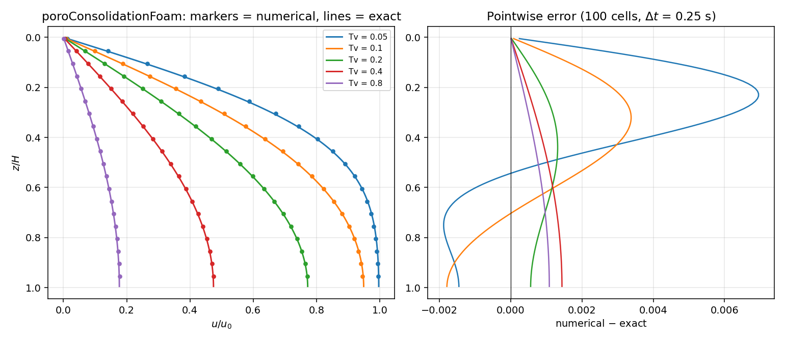
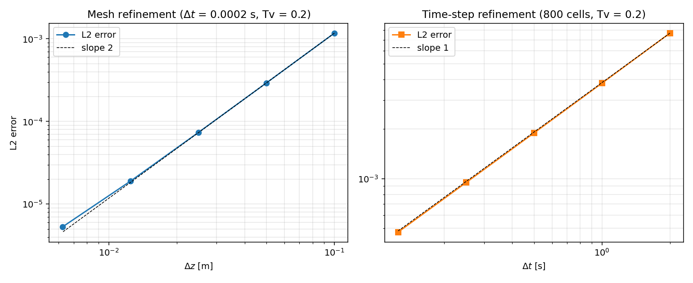

# poroConsolidationFoam

A from-scratch OpenFOAM solver for poroelastic consolidation, built as a
standalone application on the open-source OpenFOAM/foam-extend framework
and verified against an exact solution.

## Why this exists

My PhD research (UT Austin, Sharma group) uses coupled geomechanics and fluid
flow simulation for hydraulic fracturing. This project is an independent,
public demonstration of the same class of numerical methods (finite-volume
discretization of flow in deformable porous media) on a small problem where
every result can be checked against a known answer.

## Status

| Component | Status |
|---|---|
| Case setup (mesh, boundary conditions, schemes, output times) | Verified on foam-extend 4.1 and OpenFOAM v1912 |
| Numerical method (implicit Euler + finite-volume Laplacian) | Verified: 2nd order in space, 1st order in time |
| Exact reference solution (`validation/terzaghi_analytical.py`) | Checked (average consolidation matches the short-time limit 2√(Tv/π)) |
| Automated regression check (`verify.py check`) | Passes on the correct case; fails on a deliberately wrong coefficient |
| Custom solver `poroConsolidationFoam` | Compiled and verified on foam-extend 4.1; matches stock `laplacianFoam` (OpenFOAM v1912) to every printed digit |
| Phase 2 baseline: pressure–displacement coupling | Compiled and checked on foam-extend 4.1; supplied run log in `biot/phase2-all.log` |
| Phase 2 reliability revision | Compiled and verified on foam-extend 4.1; check, reliability and full studies passed on 2026-09-27 |

## The physics

**Phase 1 (this repo):** Terzaghi's 1D consolidation problem. A saturated
porous column is loaded instantaneously; the excess pore pressure `u`
dissipates by Darcy flow toward a drained boundary:

```
du/dt = cv * d2u/dz2          0 <= z <= H

u(0, t)     = 0      drained boundary
du/dz(H, t) = 0      impermeable boundary
u(z, 0)     = u0     instantaneous load
cv = k / (mv * gammaW)   coefficient of consolidation
```

Phase 1 is the *uncoupled* consolidation equation: the solid's response is
folded into the coefficient `cv`, and there's no separate displacement
field. It has an exact Fourier-series solution (Terzaghi, 1943), which makes
it the standard first benchmark for poromechanics codes.

**Phase 2 (`biot/`):** 1D Biot poroelasticity with separate pressure and
displacement fields, coupled with the fixed-stress split scheme (Kim,
Tchelepi & Juanes, 2011), and verified against the same Terzaghi solution
plus a convergence study of the coupling iterations.

## Verification approach

The results below come from `poroConsolidationFoam` compiled and run on
foam-extend 4.1. The exact solution is evaluated at the cell centres read
from the mesh files and at the solver's actual output times.

As a framework consistency check, the same case was also run through OpenFOAM's
stock `laplacianFoam` on OpenFOAM v1912. That solver discretizes the same
equation, `ddt(u) = laplacian(cv, u)`, in the same way, so the two should
agree, and they do: every error norm and consolidation value below is
identical to all printed digits across the two solvers and OpenFOAM
versions. Both share framework machinery; this agreement alone is not independent verification.

## Results

**Solver vs exact solution** (`poroConsolidationFoam`, foam-extend 4.1, 100 cells, Δt = 0.25 s):



| Tv | L2 error | L∞ error | U numerical | U exact |
|---|---|---|---|---|
| 0.05 | 3.65e-3 | 6.95e-3 | 0.25071 | 0.25231 |
| 0.1 | 2.09e-3 | 3.38e-3 | 0.35568 | 0.35682 |
| 0.2 | 9.57e-4 | 1.32e-3 | 0.50319 | 0.50409 |
| 0.4 | 1.03e-3 | 1.44e-3 | 0.69695 | 0.69788 |
| 0.8 | 7.67e-4 | 1.08e-3 | 0.88671 | 0.88740 |

At this resolution the error is dominated by the time step (see below).

**Observed orders of accuracy** (`poroConsolidationFoam`, foam-extend 4.1, L2 error at Tv = 0.2):



| Cells | L2 error | Order | | Δt [s] | L2 error | Order |
|---|---|---|---|---|---|---|
| 10 | 1.174e-3 | | | 2 | 7.686e-3 | |
| 20 | 2.931e-4 | 2.00 | | 1 | 3.811e-3 | 1.01 |
| 40 | 7.378e-5 | 1.99 | | 0.5 | 1.896e-3 | 1.01 |
| 80 | 1.900e-5 | 1.96 | | 0.25 | 9.459e-4 | 1.00 |
| 160 | 5.306e-6 | 1.84 | | 0.125 | 4.724e-4 | 1.00 |

Second order in space and first order in time, as expected for a central
finite-volume Laplacian with implicit Euler. The mesh study uses Δt = 2e-4 s
so the time error stays below the space error; at 160 cells the residual
time error (about 8e-7) starts to show, which explains the dip to 1.84.

## Repository layout

```
solver/
  poroConsolidationFoam.C    solver main loop
  createFields.H             reads field u and coefficient cv
  Make/files, Make/options   build configuration
case/
  constant/polyMesh/blockMeshDict   mesh definition
  constant/transportProperties      coefficient of consolidation cv
  system/                           controlDict, fvSchemes, fvSolution
  0/u                               initial and boundary conditions
validation/
  terzaghi_analytical.py     exact series solution (+ standalone plots)
verify.py                    comparison, convergence studies, regression check
```

## Building and running

Requires a sourced foam-extend or OpenFOAM environment.

```bash
cd solver && wmake && cd ..

python3 verify.py check                          # pass/fail against the exact solution
python3 verify.py compare                        # isochrones + error table
python3 verify.py convergence                    # mesh and time-step studies

python3 verify.py check --solver laplacianFoam   # same checks via the stock solver
```

`verify.py` copies `case/` into `runs/` for every run, so the template stays
clean. To run the case by hand instead:

```bash
cd case
blockMesh
poroConsolidationFoam
```

### Notes for foam-extend 4.1

**Mesh dictionary location.** foam-extend reads `blockMeshDict` from
`constant/polyMesh/`, which is where it lives in this repo. Newer OpenFOAM
versions expect `system/` but still fall back to `constant/polyMesh/` with a
deprecation warning; `verify.py` also places a copy in `system/` for them.

**numpy import error (`undefined symbol: cblas_sgemm`).** The foam-extend
environment puts its own libraries first on `LD_LIBRARY_PATH`, which hides
the BLAS library the system numpy needs. Run Python without
`LD_LIBRARY_PATH` and let `verify.py` re-source foam-extend for the
OpenFOAM commands it launches:

```bash
bash tools/run-python verify.py check
```

The launcher uses the sourced `WM_PROJECT_DIR/etc/bashrc`, or an explicit `OF_BASHRC`. See [the reliability revision](RELIABILITY.md) for Phase 2 commands and pass/fail criteria.

## Phase 2 verification

From the repository root, after sourcing foam-extend:

```bash
(cd biot/solver && wmake)
bash tools/run-python biot/verify_biot.py check
bash tools/run-python biot/verify_biot.py reliability
# Full studies, including intentional nonconvergence in the parameter scan:
bash tools/run-python biot/verify_biot.py all
```

`requirements.txt` lists the Python dependencies. The baseline C++ figures remain
in `biot/validation/`; new outputs are separated into `reference/` and
`biotConsolidationFoam/` subdirectories. See [RELIABILITY.md](RELIABILITY.md).

## References

- Terzaghi, K. (1943). *Theoretical Soil Mechanics.* Wiley.
- Biot, M. A. (1941). General theory of three-dimensional consolidation.
  *Journal of Applied Physics*, 12(2), 155–164.
- Kim, J., Tchelepi, H. A., & Juanes, R. (2011). Stability and convergence of
  sequential methods for coupled flow and geomechanics: Fixed-stress and
  fixed-strain splits. *Computer Methods in Applied Mechanics and
  Engineering*, 200(13–16), 1591–1606.
