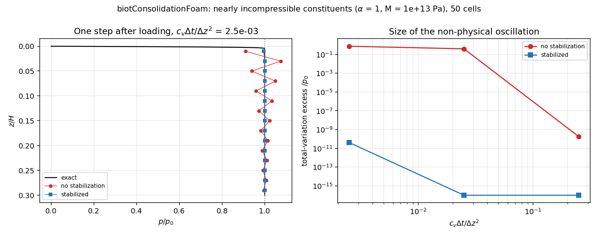
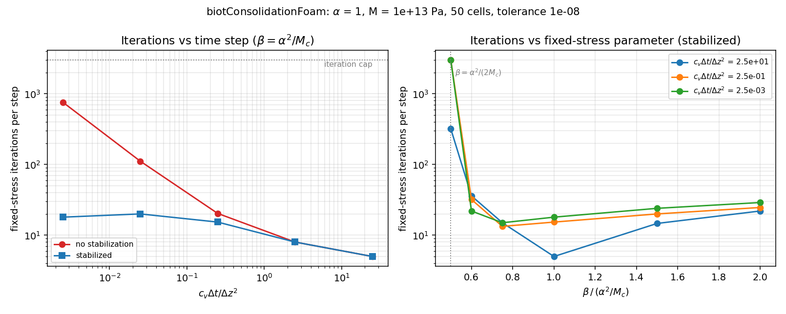

# Phase 2: biotConsolidationFoam

Two-way coupled 1D Biot consolidation (pore pressure *and* displacement),
solved with the fixed-stress split, verified against the exact solution and
against a separate reference implementation of the same discretization.

## Status

| Component | Status |
|---|---|
| Formulation, exact solution (p, w, settlement) | Derived and checked (series vs short-time erf form agree to 1e-15) |
| Discretization analysis (strain defect, stabilization) | Analytical identity supported by numerical checks; uniform 1D grid and stated BCs only |
| Reference implementation (`reference/biot_ref.py`) | Verified: 2nd order in space, 1st order in time, for p and w |
| OpenFOAM solver `biotConsolidationFoam` | Baseline compiled and checked on foam-extend 4.1; revised reliability code needs a new compile/run |
| `verify_biot.py check` | Passes with the reference backend; catches a wrong mobility and a 1e-4 implementation discrepancy |

The existing figures directly in `validation/` and `phase2-all.log` came from
Nakul's baseline C++ run. They are preserved. New results go into
`validation/reference/` or `validation/biotConsolidationFoam/`; the reference
backend never overwrites C++ figures. The reliability revision's C++ results
remain pending until rebuilt and checked on the workstation.

## Physics

Uniaxial strain, quasi-static, small strain; z points down from the loaded,
drained top (z = 0) to the fixed, impermeable base (z = H):

```
equilibrium   d/dz( Mc dw/dz - alpha p ) = 0
fluid mass    (1/M) dp/dt + alpha d/dt(dw/dz) = d/dz( (k/mu) dp/dz )
```

`Mc = K + 4G/3` (drained constrained modulus), `M` (Biot modulus), `alpha`
(Biot coefficient), `k/mu` (mobility). A compressive load `sigma0` is applied
suddenly at the top.

Because the total stress is uniform in 1D, the strain is slaved to the
pressure, `dw/dz = (alpha p - sigma0)/Mc`, and the mass balance collapses to
Terzaghi's diffusion equation with

```
cv = (k/mu) / (1/M + alpha^2/Mc)                 generalized consolidation coefficient
p0 = alpha M sigma0 / (Mc + alpha^2 M)           undrained pressure (loading efficiency)
s0 = sigma0 H / (Mc + alpha^2 M),  s_inf = sigma0 H / Mc    undrained / drained settlement
```

The exact displacement follows by integrating the strain:
`w(z,t) = [ sigma0 (H - z) - alpha p0 H sum (2/M_m^2) cos(M_m z/H) exp(-M_m^2 Tv) ] / Mc`,
with `M_m = (2m+1) pi/2` and `Tv = cv t / H^2`.

For the default parameters (`Mc` = 100 MPa, `M` = 200 MPa, `alpha` = 0.8,
`sigma0` = 1 MPa, H = 1 m): `p0` = 0.702 `sigma0`, `s0` = 4.39 mm, `s_inf` = 10 mm,
`cv` = 0.01 m²/s.

## Numerics, and what the analysis found

The solver stores `p` and `w` at cell centres (the natural OpenFOAM layout).
On this collocated grid the discrete volumetric strain in every cell is
exactly

```
eps_i = (alpha/Mc) [ p_i + (h^2/4) (Lap_h p)_i ] - sigma0/Mc
```

including the boundary cells (verified to 1e-18). The `h^2/4` term is an
averaging, `(p_{i-1} + 2 p_i + p_{i+1})/4`, which annihilates an alternating pressure pattern in interior cells.
Boundary rows modify that pattern: on this finite mixed-BC domain, describe
the highest-frequency mode as weakly coupled rather than an exact global null mode. Two consequences, both measured:

1. **Non-physical early-time oscillations.** For nearly incompressible
   constituents and small `cv dt / h^2`, the pressure one step after loading
   overshoots the undrained value by up to 12.5% and zig-zags from cell to
   cell (total-variation excess up to 0.74 `p0`).
2. **Stalled fixed-stress iterations.** The same mode is nearly undamped in
   the fixed-stress iteration: iterations per step grow from 5 to 758 as
   `cv dt / h^2` falls from 25 to 2.5e-3, and the split fails to converge
   within 2000 iterations at 2.5e-4.

Adding `-d/dt div(tau grad p)` to the mass balance with
`tau = alpha^2 h^2 / (4 Mc)` cancels the defect exactly (cf. Aguilar, Gaspar,
Lisbona & Rodrigo, 2008). With it, overshoot and oscillation drop to machine
about 1e-11 or lower in the baseline early-time C++ tests. Those tests required
up to 26 iterations; the separate default-factor scan had mean iteration counts
up to 20. Second-order spatial accuracy was observed in the refinement study.

The fixed-stress parameter `beta = alpha^2/Mc` is the robust default. The
scan shows the iteration count rising steeply as `beta` approaches
`alpha^2/(2 Mc)` in this test. This observed behavior should not be presented
as a universal sharp convergence threshold for every discretization or parameter set; and an optimum between 0.6 and 1 × `alpha^2/Mc`
depending on the time step.

## Baseline results (C++ run supplied by Nakul; also reproduced by the reference)

Default case, 100 cells, dt = 0.25 s, stabilized:

| Tv | L∞(p)/p0 | L∞(w)/s∞ | settlement error / s∞ |
|---|---|---|---|
| 0.05 | 6.95e-3 | 8.82e-4 | −8.64e-4 |
| 0.1 | 3.38e-3 | 6.26e-4 | −6.14e-4 |
| 0.2 | 1.32e-3 | 4.97e-4 | −4.88e-4 |
| 0.4 | 1.44e-3 | 5.19e-4 | −5.13e-4 |
| 0.8 | 1.08e-3 | 3.86e-4 | −3.84e-4 |

Observed orders at Tv = 0.2 (mesh study uses Richardson extrapolation in
time, 2u(dt/2) − u(dt), to remove implicit Euler's first-order error):

| Cells | L2(p)/p0 | order | L2(w)/s∞ | order |
|---|---|---|---|---|
| 10 | 1.173e-3 | | 3.167e-5 | |
| 20 | 2.924e-4 | 2.00 | 7.760e-6 | 2.03 |
| 40 | 7.304e-5 | 2.00 | 1.930e-6 | 2.01 |
| 80 | 1.826e-5 | 2.00 | 4.819e-7 | 2.00 |
| 160 | 4.564e-6 | 2.00 | 1.204e-7 | 2.00 |

Time-step refinement (800 cells) gives order 1.00 for both fields.





## Layout

```
solver/                     biotConsolidationFoam.C, createFields.H, pEqn.H, wEqn.H, Make/
case/                       example case (constant/biotProperties holds all parameters)
reference/biot_ref.py       exact solution + reference implementation
verify_biot.py              studies and regression check (two backends)
validation/                 figures
```

## Building and running (foam-extend 4.1)

```bash
cd solver && wmake && cd ..
bash ../tools/run-python verify_biot.py check     # exact solution + reference agreement + convergence of the split
bash ../tools/run-python verify_biot.py all       # compare, convergence, oscillations, fixedstress
```

The launcher isolates Python from foam-extend's library path and re-sources
foam-extend for child commands. Every study also runs without OpenFOAM:
`python3 verify_biot.py all --solver reference`. Run `reliability` for restart,
monolithic agreement and failure-path tests. See `../RELIABILITY.md` for gates.

Smaller `cv*dt/h^2` can result from lower diffusivity or a smaller time step.
At fixed diffusivity and time step, refining the mesh INCREASES this ratio.
The investigation reproduces and explains a known class of numerical issues;
no literature-novelty claim is made. Bibliographic details below are inherited
from the baseline and need publisher verification before formal citation.

## References

- Biot, M. A. (1941). General theory of three-dimensional consolidation. *J. Appl. Phys.* 12, 155–164.
- Terzaghi, K. (1943). *Theoretical Soil Mechanics.* Wiley.
- Detournay, E., & Cheng, A. H.-D. (1993). Fundamentals of poroelasticity. In *Comprehensive Rock Engineering*, Vol. 2, 113–171.
- Wang, H. F. (2000). *Theory of Linear Poroelasticity.* Princeton University Press.
- Gaspar, F. J., Lisbona, F. J., & Vabishchevich, P. N. (2003). A finite difference analysis of Biot's consolidation model. *Appl. Numer. Math.* 44, 487–506.
- Aguilar, G., Gaspar, F., Lisbona, F., & Rodrigo, C. (2008). Numerical stabilization of Biot's consolidation model by a perturbation on the flow equation. *Int. J. Numer. Meth. Eng.* 75, 1282–1300.
- Kim, J., Tchelepi, H. A., & Juanes, R. (2011). Stability and convergence of sequential methods for coupled flow and geomechanics: fixed-stress and fixed-strain splits. *Comput. Methods Appl. Mech. Eng.* 200, 1591–1606.
- Haga, J. B., Osnes, H., & Langtangen, H. P. (2012). On the causes of pressure oscillations in low-permeable and low-compressible porous media. *Int. J. Numer. Anal. Meth. Geomech.* 36, 1507–1522.
- Mikelić, A., & Wheeler, M. F. (2013). Convergence of iterative coupling for coupled flow and geomechanics. *Comput. Geosci.* 17, 455–461.
